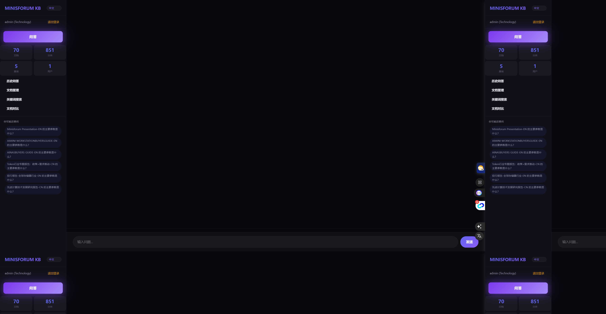
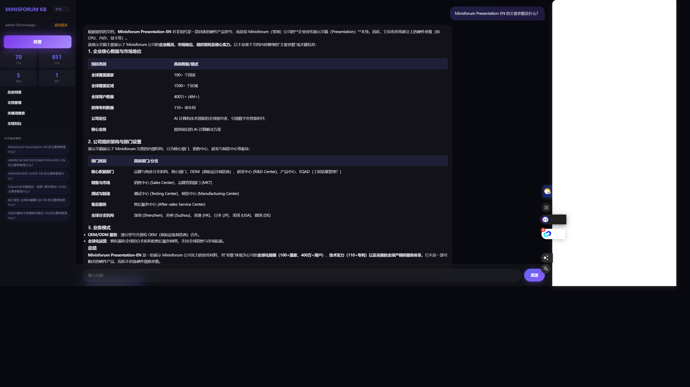
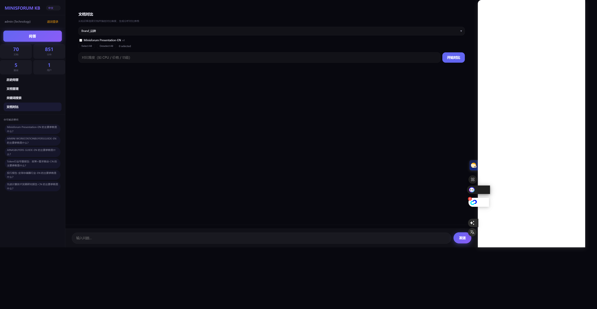

# KB Server — 单文件本地知识库

> **一个 .py 文件 = 完整私有知识库。** 后端 + 前端 + 混合检索 + OCR 全部打包在单个文件里，5 分钟在 NAS / 家用服务器上跑起来，数据不出内网。

[](LICENSE)
[](https://www.python.org/)
[](https://fastapi.tiangolo.com/)

---

## 为什么是它

本地知识库赛道不缺项目，但大多重：要装向量数据库、要配前端框架、要编排一堆容器。**KB Server 反着来**：

| 对比项 | KB Server | 主流方案（RAGFlow / Dify / AnythingLLM） |
|---|---|---|
| 部署形态 | **单文件**，一个 `.py` 跑起全部 | 多容器编排，依赖向量库/中间件 |
| 向量检索 | **numpy 内存矩阵**，零外部依赖 | 需 Milvus / Chroma / ES 等 |
| 前端 | **内嵌 Web UI**，无需单独部署 | 独立前端工程 |
| 资源占用 | 低，NAS 小内存可跑 | 通常 16GB+ |
| 中文场景 | 原生优化（翻译回退、问题质量识别） | 部分支持 |

**一句话定位：给 NAS 用户和中小团队一个"下载即用、不折腾"的私有知识库。**

---

## 功能特性

### 检索
- **混合检索**：向量语义检索 + BM25 关键词检索，RRF 分数融合，兼顾"懂意思"和"查得准"
- **中文优化**：中文查询自动翻译回退、模糊问题识别、相关问题推荐
- **查询缓存**：TTL 内存缓存，重复问题秒回

### 文档
- **12 种格式解析**：`txt / md / html / pdf / docx / xlsx / csv / pptx / json` + 图片
- **内置 OCR**：扫描件 PDF / 图片自动文字识别（PaddleOCR，CPU 可跑）
- **版本管理**：同名文档自动存版本，支持版本 diff 对比
- **文档对比 / 规格对比**：两文档差异、参数规格逐项对照

### 模型
- **多模型通道**：主问答 / 聊天 / 对比可分别指定模型
- **GPU 加速通道**：支持接入 OpenAI 兼容 API（如 faster_llm / vLLM），35B 大模型秒级响应
- **SSE 流式输出**：打字机效果，首 token 低延迟

### 安全与协作
- **JWT 鉴权** + 多用户注册审批
- **部门隔离**：文档按部门/角色权限检索
- **知识图谱**：文档关联可视化
- **统计看板**：检索量、文档热度一目了然

---

## 快速开始

### Docker 一键部署（推荐）

仓库已内置 `Dockerfile` 与 `requirements.txt`，本地构建即可：

```yaml
# docker-compose.yml
services:
  kb-server:
    build: .                        # 本地构建（Dockerfile 已内置）
    container_name: kb-server
    ports:
      - "8080:8080"
    volumes:
      - ./docs:/kb_persist/docs      # 文档目录
      - ./data:/kb_persist           # SQLite 数据库
    environment:
      - OLLAMA_HOST=http://ollama:11434   # 你的 Ollama 地址
      - KB_MODEL_ASK=Qwen_Qwen3.6-35B-A3B-Q4_K_M.gguf  # 你的模型
      - KB_MODEL_CHAT=Qwen_Qwen3.6-35B-A3B-Q4_K_M.gguf # 你的模型
    restart: unless-stopped
```

```bash
docker compose up -d --build
# 打开 http://<你的NAS>:8080
```

> 首次构建需拉取 PaddleOCR 依赖，耗时较长；不需要 OCR 时可在 `requirements.txt` 中注释 `paddleocr` / `paddlepaddle` 两行，并设置 `KB_OCR_ENABLED=0` 以大幅减小镜像。

### 裸机运行

```bash
pip install -r requirements.txt
python kb_server.py
# 打开 http://localhost:8080
```

> 依赖清单见 `requirements.txt`（OCR 可关：`KB_OCR_ENABLED=0`）

---

## 架构

```
┌─────────────────────────────────────────────┐
│              KB Server (单文件)              │
│  ┌─────────┐  ┌──────────┐  ┌───────────┐  │
│  │ Web UI  │  │  FastAPI │  │  SSE 流式  │  │
│  │ (内嵌)  │  │  REST API│  │  输出      │  │
│  └─────────┘  └────┬─────┘  └───────────┘  │
│                    │                        │
│  ┌─────────────────▼─────────────────────┐  │
│  │  混合检索 (hybrid_search)              │  │
│  │  ┌──────────┐   ┌──────────┐          │  │
│  │  │ 向量检索  │   │  BM25    │          │  │
│  │  │(numpy矩阵)│   │(关键词)  │          │  │
│  │  └────┬─────┘   └────┬─────┘          │  │
│  │      RRF 分数融合     │                │  │
│  └───────┼──────────────┼────────────────┘  │
│          │              │                    │
│  ┌───────▼──────────────▼──────┐  ┌────────┐ │
│  │ 文档解析 + 分块 + 向量化      │  │ SQLite │ │
│  │ (12格式 + OCR)              │  │ 元数据  │ │
│  └──────────────┬──────────────┘  └────────┘ │
└─────────────────┼────────────────────────────┘
                  │
        ┌─────────▼─────────┐
        │  Ollama / OpenAI  │
        │  兼容 API (LLM)   │
        └───────────────────┘
```

---

## 配置项（环境变量）

| 变量 | 默认值 | 说明 |
|---|---|---|
| `KB_DOCS_DIR` | `/kb_persist/docs` | 文档存储目录 |
| `KB_DB_PATH` | `/kb_persist/kb.db` | SQLite 数据库路径 |
| `OLLAMA_HOST` | `http://localhost:11434` | Ollama 服务地址 |
| `KB_MODEL_ASK` | `Qwen_Qwen3.6-35B-A3B-Q4_K_M.gguf` | 主问答模型 |
| `KB_MODEL_CHAT` | `Qwen_Qwen3.6-35B-A3B-Q4_K_M.gguf` | 聊天模型 |
| `KB_MODEL_COMPARE` | `Qwen_Qwen3.6-35B-A3B-Q4_K_M.gguf` | 对比模型 |
| `KB_GPU_LLM_URL` | `http://localhost:13306/v1` | GPU 加速通道（OpenAI 兼容） |
| `KB_GPU_LLM_MODEL` | `Qwen_Qwen3.6-35B-A3B-Q4_K_M.gguf` | GPU 通道模型 |
| `KB_EMBED_MODEL` | `nomic-embed-text` | 向量化模型 |
| `KB_TOP_K` | `6` | 检索返回条数 |
| `KB_CHUNK_MAX` | `800` | 分块大小（字符） |
| `KB_CHUNK_OVERLAP` | `100` | 分块重叠 |
| `KB_MAX_CONTEXT_CHARS` | `3000` | 拼入 prompt 的上下文上限 |
| `KB_OCR_ENABLED` | `1` | 是否启用 OCR |
| `KB_CACHE_TTL` | `300` | 查询缓存秒数 |
| `KB_JWT_SECRET` | `kb_local_secret_change_me` | JWT 密钥（务必修改） |

---

## API 概览

| 方法 | 路径 | 说明 |
|---|---|---|
| POST | `/api/kb/ask` | 知识库问答（SSE 流式） |
| POST | `/api/chat` | 自由聊天（SSE 流式） |
| POST | `/api/kb/upload-multipart` | 上传文档 |
| GET | `/api/docs` | 文档列表 |
| DELETE | `/api/docs/{doc_id}` | 删除文档 |
| GET | `/api/docs/{doc_id}/versions` | 版本列表 |
| POST | `/api/docs/versions/diff` | 版本差异对比 |
| POST | `/api/kb/compare` | 文档对比 |
| POST | `/api/spec/compare` | 规格参数对比 |
| GET | `/api/search` | 全文检索 |
| GET | `/api/related-questions` | 相关问题推荐 |
| GET | `/api/kb/graph` | 知识图谱 |
| GET | `/api/stats` | 统计看板 |
| POST | `/api/login` / `/api/register` | 登录 / 注册 |
| GET | `/api/health` | 健康检查 |

---

## 截图

主界面（问答）：



问答流式输出：



文档对比：



---

## 路线图

- [x] 混合检索（向量 + BM25 + RRF）
- [x] 12 格式解析 + OCR
- [x] 多模型通道 + GPU 加速
- [x] 文档版本管理 / 对比
- [x] JWT 鉴权 + 多用户审批
- [x] 多语言 README（中文 / English）
- [x] 一键启动脚本（start.sh）
- [ ] 一键安装脚本（群晖 / 威联通套件）
- [ ] 更多向量后端可选（Chroma / FAISS）
- [ ] Webhook 文档自动同步

---

## 许可证

MIT
